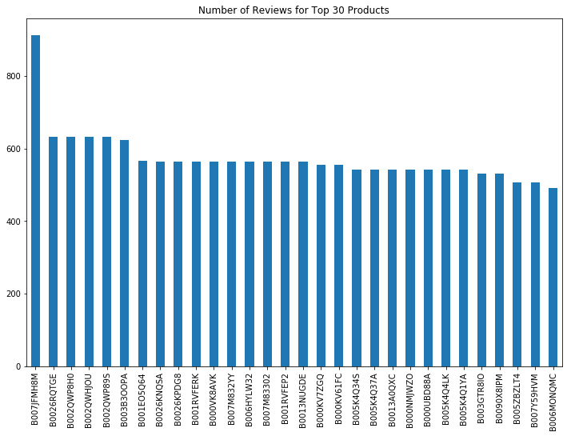
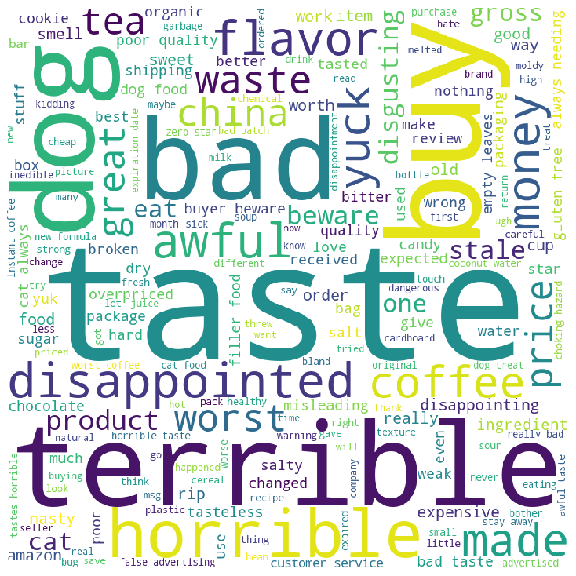

## Steps for Review sentiment analysis - NLP

1. Clone this repository - `git clone`.
2. Put Review.csv file in project directory
3. Open the jupyter notebook to run `assignment.ipynb`.
4. Run every cell in jupyter notebook.

**Note:**
modify_review.csv will be created after running the last cell.

## Technique used

**Libraries**

`import pandas as pd`

`from rake_nltk import Rake`

`import numpy as np`

`from sklearn.metrics.pairwise import cosine_similarity`

`from sklearn.feature_extraction.text import CountVectorizer`

`import string`

`import re`

`import nltk`

`from nltk.corpus import stopwords `

`from nltk.tokenize import WordPunctTokenizer`

`nltk.data.path`

`import numpy as np`

`import pickle`

`import json`

`import random`

**Data Visualization**

**Wordcloud**

1. Positive review
   

2. Negative review
   

## Steps for Review sentiment analysis - API

1. Put modify_review.csv file in project directory.
2. Open up terminal in project directory
3. Run `py app.py` in terminal

**To check APIs**

1. `GET: http://127.0.0.1:5000/?month=2&year=2011`

Attaching screenshot for `GET` request

